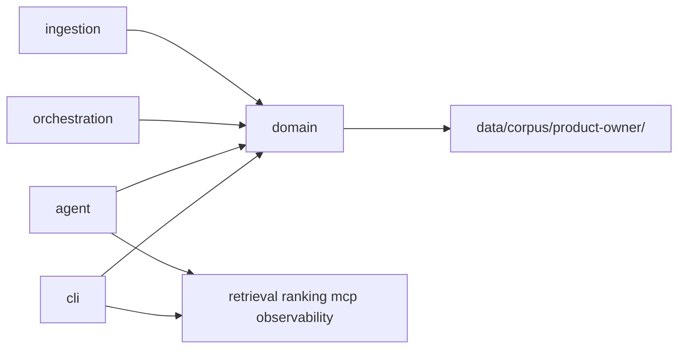

# Abstracción de dominio (sin hardcode de negocio)

**Goal:** Que el “qué es este coach” (PO hoy, otro dominio mañana) viva en un solo lugar, y que el resto del código sea genérico.

**Decisión:** Se mantiene la estructura actual (`ingestion/`, `retrieval/`, `cli/`, etc.). Solo se agrega `src/domain/` como fuente de verdad de negocio. No se implementa RAG ni se renombra el paquete.

## Separación



- **Core / infraestructura** (agnóstico): `cli`, `ingestion`, `retrieval`, `ranking`, `orchestration`, `agent`, `mcp`, `observability`
- **Dominio** (intercambiable): `src/domain/` + corpus bajo `data/corpus/<domain-id>/`

## Cambios concretos

### 1. Nuevo módulo [`src/domain/`](src/domain/)

- [`src/domain/__init__.py`](src/domain/__init__.py) — reexporta lo público
- [`src/domain/config.py`](src/domain/config.py) — dataclass `DomainConfig` con:
  - `id` (ej. `"product-owner"`)
  - `display_name` (ej. `"PO Copilot"`)
  - `tagline` (frase corta del coach)
  - `corpus_dir` (Path relativo, ej. `data/corpus/product-owner`)
  - `exit_commands` (frozenset, default `exit` / `salir`)
  - Placeholders listos para después: `system_prompt` (string vacío o stub mínimo) y `tools` (lista vacía) — sin lógica MCP aún
- [`src/domain/registry.py`](src/domain/registry.py) — `get_domain(domain_id: str | None = None) -> DomainConfig`
  - Default: dominio `product-owner` (el de hoy)
  - Variable de entorno `DOMAIN_ID` para elegir dominio sin tocar código
- [`src/domain/product_owner.py`](src/domain/product_owner.py) — instancia concreta del dominio PO (única fuente de copy de negocio)

Mañana: agregar `src/domain/otro.py` + entrada en el registry; el CLI no cambia.

### 2. Actualizar [`src/cli/main.py`](src/cli/main.py)

- Cargar `domain = get_domain()` al inicio
- Saludo y textos desde `domain.display_name` / `domain.tagline`
- Salida con `domain.exit_commands`
- Stub de respuesta genérico (sin mencionar “retrieval de producto”), p.ej. `[stub] Dominio '{domain.id}' activo. Todavía no hay retrieval: {query}`

### 3. Corpus

- Crear `data/corpus/product-owner/.gitkeep` (mover el gitkeep de `data/corpus/` si aplica)
- El path canónico vive en `DomainConfig.corpus_dir`

### 4. [`.env.example`](.env.example)

- Agregar `DOMAIN_ID=product-owner`

### 5. [`README.md`](README.md)

Actualizar de forma mínima y clara:

- Nueva subsección **“Dominio vs infraestructura”**: qué va en `domain/`, qué no, y cómo cambiar de dominio (`DOMAIN_ID` + nuevo módulo)
- En la tabla de componentes, fila `domain/`
- En estructura del repo, incluir `src/domain/` y `data/corpus/product-owner/`
- Ajustar menciones que asumen PO hardcodeado en el pipeline genérico (dejar PO como dominio *default*, no como acoplamiento del core)

## Verificación

```bash
source .venv/bin/activate
printf 'hola\nsalir\n' | python -m src.cli.main
```

Debe mostrar el saludo desde `DomainConfig` y el stub con `domain.id`.

## Fuera de alcance

No tocar ingestion/retrieval/agent/MCP. No múltiples dominios reales todavía (solo el PO + el mecanismo para agregar más).
